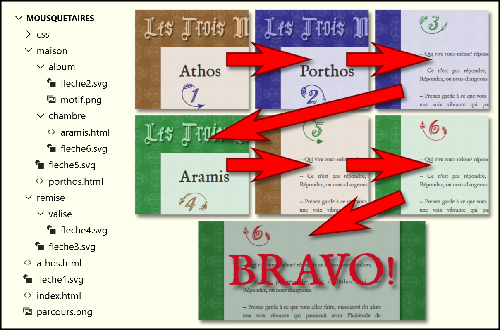

## Web I — Exercice formatif
# Exercice "Mousquetaires"

1. Le but de l'exercice est d'ajouter des liens et des images.
1. Regarder la démo du prof.
1. Récupérer le [dossier de travail 📁](https://github.com/web1cstj/mousquetaires/archive/refs/heads/depart.zip).
1. Il y a 3 fichiers HTML à modifier.
1. Dans chaque page, il y a un paragraphe (toujours le même) dans lequel on doit rendre cliquables les mots "Athos", "Porthos" et "Aramis" pour permettre à l'usager de se rendre à la page correspondante.
1. Il y a en tout 6 images de flèches numérotées à ajouter en se fiant au schéma [`parcours.png`](parcours.png) qui se trouve dans le dossier de travail.
1. Chaque image est cliquable et pointe vers l'emplacement de la flèche suivante (donc, 6 liens)
1. Il est __interdit__ de modifier l'emplacement des fichiers.
1. Note: Il va sans dire que les toutes les adresses doivent être __relatives__.

## Par étape
Faire chaque partie __au complet__ avant de passer à la suivante.

### A. Les liens simples
1. Ajouter les liens sur les mots "Athos", "Porthos" et "Aramis" dans toutes les pages (9 liens en tout).
1. Ces liens doivent mener vers la page correspondante.

### B. Les flèches
1. Ajouter les 6 images de flèches.
1. Les flèches __1__ et __5__ vont dans `athos.html`
1. Les flèches __2__ et __3__ vont dans `porthos.html`
1. Les flèches __4__ et __6__ vont dans `aramis.html`
1. Plus précisément, les flèches __1__, __2__ et __4__ se placent tout juste après l'élément `h1` et les flèches __3__, __5__ et __6__ se placent tout juste après la ligne «Qui vive?».

### C. Les liens sur les images
1. Envelopper les images de balises `<a>` (6 liens en tout). Ces liens doivent mener vers la bonne __PAGE__. Ne pas se soucier de l'ancre pour l'instant.
1. Dans les liens des flèches __3__, __5__ et __6__, ajouter un attribut `id` avec une valeur significative. Le `id` doit suivre les standards de nomenclature, notamment ne pas commencer par un chiffre.
1. Dans les liens des flèches __2__ et __4__, ajouter, à la fin de l'attribut `href`, un dièze (`#`) suivi du `id` de la flèche correspondante.
1. Dans le lien de la flèche __2__, comme celui-ci pointe dans vers la page courante, on peut (doit) enlever le nom du fichier (`porthos.html`).

### D. Et le «Bravo!»
1. Au bas de la page `aramis.html`, ajouter un `` ayant l'attribut `id` avec la valeur `"fin"`.
1. Faire en sorte que la flèche __6__ pointe vers celui-ci.

## Solution

Vous pouvez [télécharger la solution 📁](https://github.com/web1cstj/mousquetaires/archive/refs/heads/depart.zip) afin de la comparer avec votre travail.
